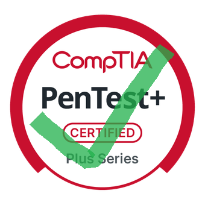
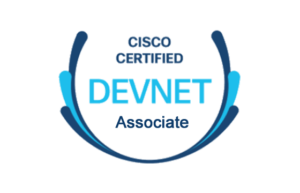
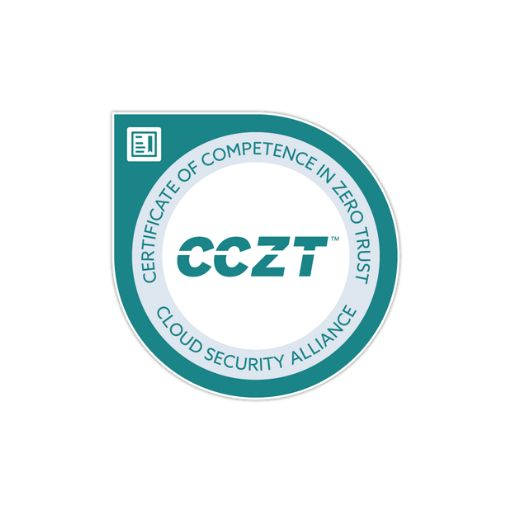

<h2>$ whoami</h2>
 
My name is Lamyae, I have a M.S degree in Cybersecurity and Information Assurance and I am currently working for a government contractor as a SOC Analyst with 6 years of accumumulated IT experience.
<h2>$ ls certifications</h2>
 

  
 
  
   
   
   
   

<h2>$ ls projects</h2>
- Dynamic website hosted in AWS
 
- Python automation scripts
 
- ML, Gen-AI, LLM expertise
 
- Pentesting components

<h2>$ ls tryhackme/achievements</h2>
https://tryhackme.com/p/yamsrwx
