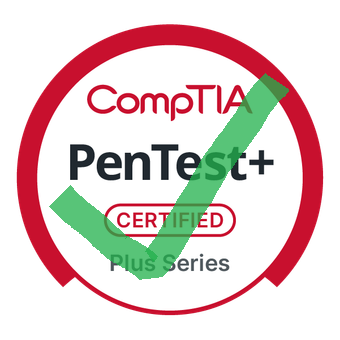
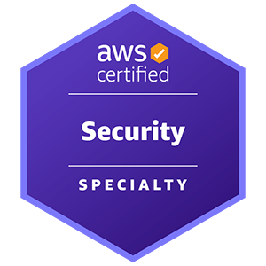
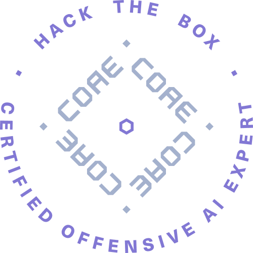

<h2>$ whoami</h2>
 
My name is Lamyae. This GitHub is where I document my journey in AI Security, Cloud Security, Threat Detection, Bug Bounty, and Python automation. I use it to showcase hands-on labs, projects, and continuous learning as I keep up with today's cyber landscape. 
 
 

 
1) AZ-500 - Azure Security Engineer Associate.
 
2) COAE -  HTB Certified Offensive AI Expert.
 
3) AWS Security - AWS Certified Security Specialty
 
4) Bug Bounty and Vulnerability research. 
 
5) Python scripting and automation. 
 
6) Threat Detection

<h2>$ ls certifications</h2>
 

  
 
  
   
   
  

<h2>$ ls repos</h2>
- AI Red Teaming (COAE) prep 
 
- AZ-500 prep
 
- AWS Security
 
- Bug Bounty prep
 
- Python automation
 
- Threat Detection
