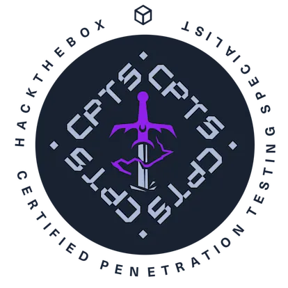

<h2>$ whoami</h2>
 
My name is Lamyae. I will be using this GitHub account to show the different projects that I am currently working on. 
<h2>$ ls certifications</h2>
 

  
 
  
  
   
   
  

<h2>$ ls repos</h2>
- AZ-500 prep
 
- Python automation
 
- CPTS prep 
 
- AI Red Teaming prep
 
- AWS Security prep

