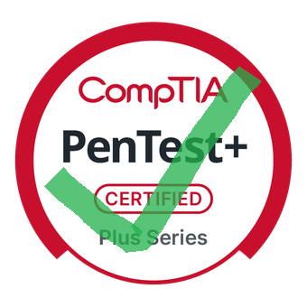
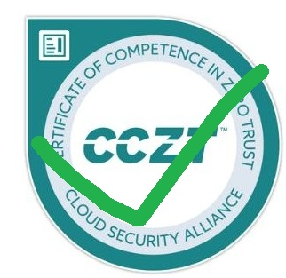
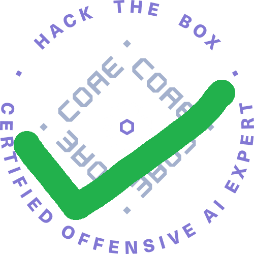
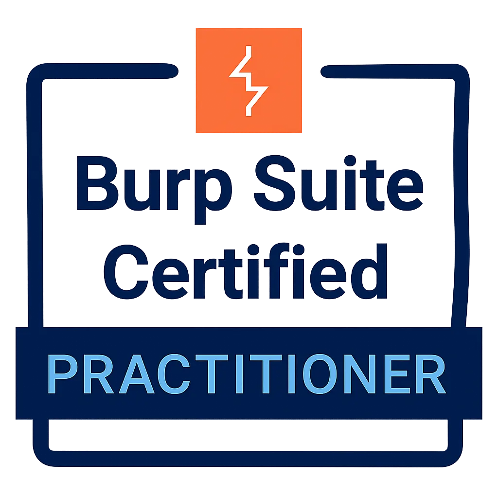
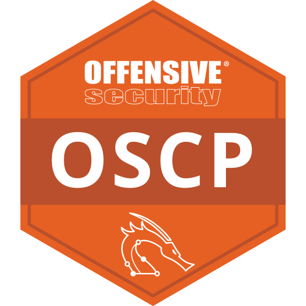

<h2>$ whoami</h2>
 
My name is Lamyae. This GitHub is where I document my journey in AI Security, Cloud Security and Pentesting. I use it to showcase hands-on labs, projects, and continuous learning as I keep up with today's cyber landscape. 
 
 

<h2>$ ls certifications</h2>
 

   
  
  
 
  
  
  
   
   
  

<h2>$ ls repos</h2>
- AI Red Teaming (COAE) prep 
 
- SC-500 prep
 
- AWS Security
 
- Bug Bounty Prep
 
- AI/LLM/ML Penetration Testing
 
